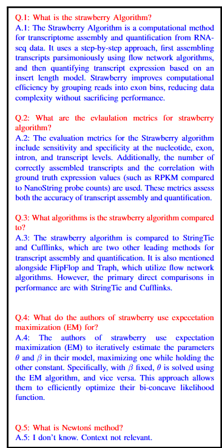
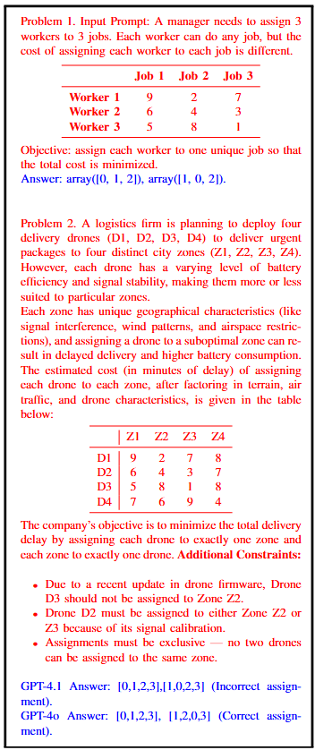

# mathCrow: Agentic AI for math and reasoning tasks

## Abstract

mathCrow is a proof-of-concept extension of ChemCrow for math-based tasks. The agent autonomously selects and uses two specialized tools, replacing the need for human decision makoing in tool choice and data preprocessing. We provide an open-source, zero-cost implementation using Meta’s Llama 3.3 and HuggingFace embeddings, and evaluate it on datasets from two research papers and complex linear assignment problems (LAP). Results show mathCrow reduces hallucinations, improves autonomous task completion, and confirms that GPT-o reasoning models outperform general models for LAP reasoning tasks.

## Description

The MathCrow agent has access to two compnents, A) tools
and B) memory.

### A) Tools Description
#### Tool 1 Agentic-Retrieval Augmented Generation (RAG) Tool: 

First, we describe the difference between agentic RAG and RAG.
A thorough comparison between the two can also be found
at [9]. While both methods involve retrieving context from
an external vector database Fig. 5, agentic RAG, where recall
that the agent is essentially an LLM, rewrites the query before
searching for relevant context in the vector database 5. This
is crucial because user/input queries to the vector database
are often in the form of questions whereas the content of
the database is not. To rewrite the query, the agent uses the
description of the retrieval tool, which is a brief description
of the data/documents stored in the vector database. The hyperparameters for RAG were tuned in a broad range and the final values are reported in the table below.

#### Tool 2 Linear Assignment Problem (LAP) solver

The LAP solver tool is implemented by wrapping the ‘linear sum assignment’ function from the
‘scipy.optimize’ library as a tool. Wrapping a function as a
tool, which is possible using Langgraph, makes these functions
callable for the agent (or LLM). Langgraph also allows a
description of the of the function arguments so that the agent
can design these arguments appropriately when calling it.

### B) Memory/Vectorstore Description
The vector store is an external storage that contains the
dense embeddings of the text. A key design requirement
of the vector store is that it should allow a fast similarity
search of the stored text with the input query. There are
two widely used vector dataabaes: FAISS from Meta and Chroma. It is important to note thats the input query
and the documents in the database are compared based off of
the numerical embeddings. This is unlike other word-based
frequency matching methods such as TF-IDF.

## Algorithm and LangGraph Implementation

We use LangGraph, which implements agentic frameworks using states, nodes and edges. States
are represented by a global variable, usually a list of strings.
The graph begins at the ‘start’ node with the state variable
equal to input query. The state is then passed from the start
node, through a sequence of nodes, to the ‘end’ node. The
state flow (transitioning between nodes) is controlled by edges.
Nodes and edges are both represented by python function.
Typically, nodes modify the state (by appending the list of
messages) and edges analyze, given the current state, the
next node to transition to. For a visual representation of the
mathCrow agentic framework, see the figure below.

## Results

### RAG RESULTS
The results for the RAG Tool are below. The relevant text for the RAG model was the reserach paper [2].

### LAP SOLVER RESULTS
The results for the RAG Tool are below. Notice how the agentic framework accepts a natural language description of the problem, formulates a mathematical problem (incorrectly formulated by the non-reasonin model) and calls the appropriate solver.

## References
1.  Andres M. Bran, Sam Cox, Oliver Schilter, Carlo Baldassari, Andrew D White, and Philippe Schwaller. Augmenting large language models with chemistry tools. Nature Machine Intelligence, 6(5):525–535, 2024.
2.  Ruolin Liu and Julie Dickerson. Strawberry: Fast and accurate genomeguided transcript reconstruction and quantification from rna-seq. PLoS computational biology, 13(11):e1005851, 2017.
